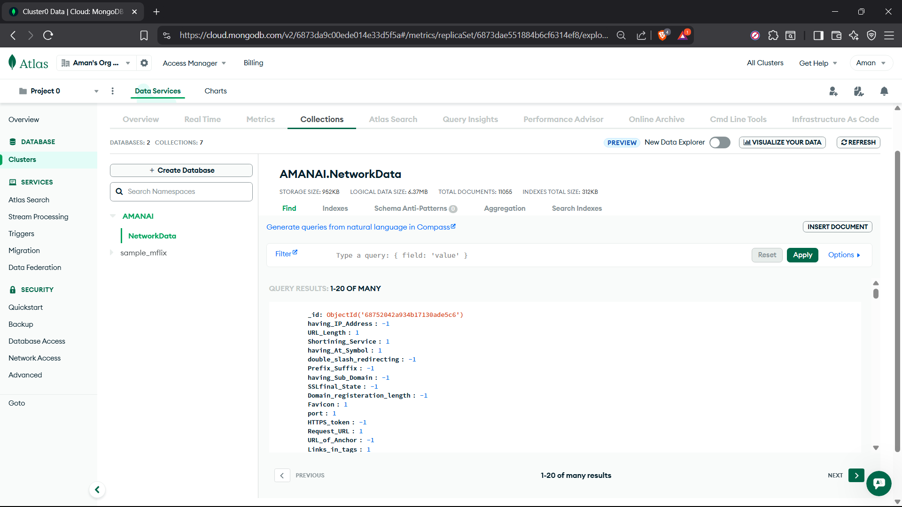
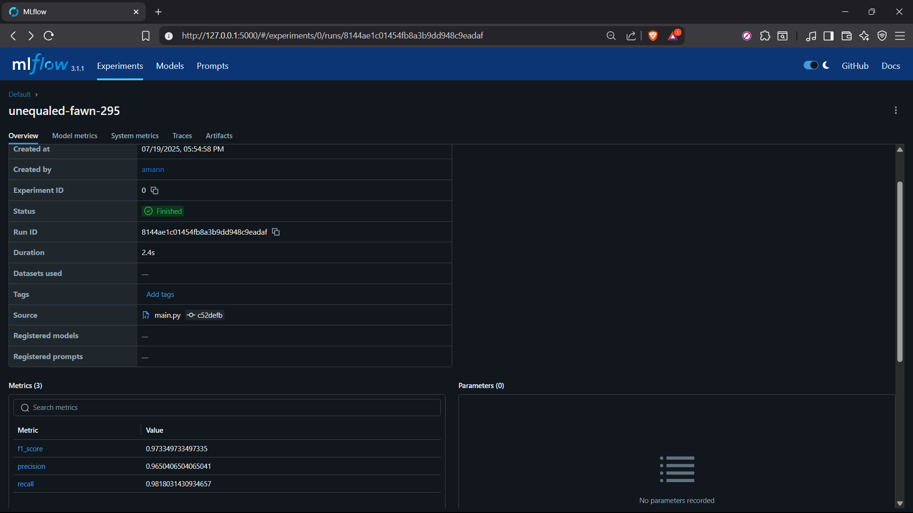
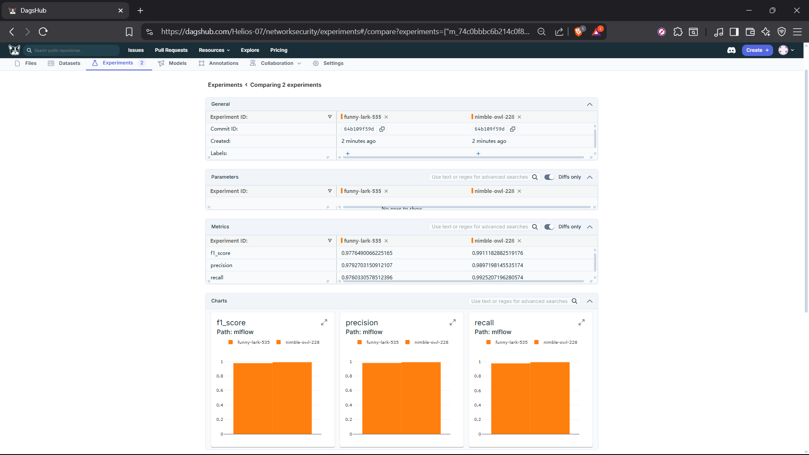

### Network Security Project for Phising Data

### 📦 Dataset
📦 Dataset
The core dataset is stored in a MongoDB Atlas database. An ETL (Extract, Transform, Load) pipeline is used to process and load the data, which contains various features extracted from network traffic to be used for model training.

---

### 📊 Experiment Tracking & Versioning
We use MLflow for tracking experiments and DagsHub for versioning our code and data, and for comparing results.

## Single Experiment Run
Here is a view of a single experiment's details and metrics tracked in MLflow.

## Comparing Experiments
DagsHub provides a powerful interface to compare different experiment runs side-by-side, helping us select the best-performing model.
